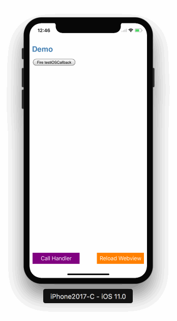

[](https://github.com/apple/swift)&nbsp;
[](https://github.com/Carthage/Carthage)&nbsp;
[](https://raw.githubusercontent.com/Lision/WKWebViewJavascriptBridge/master/LICENSE)&nbsp;
[](https://www.apple.com/nl/ios/)&nbsp;
[](http://cocoadocs.org/docsets/WKWebViewJavascriptBridge)&nbsp;
[](https://travis-ci.org/Lision/WKWebViewJavascriptBridge)&nbsp;
[](http://cocoapods.org/pods/WKWebViewJavascriptBridge)

> 此项目基于 [WebViewJavascriptBridge](https://github.com/marcuswestin/WebViewJavascriptBridge)，在其上仅对 WKWebView 提供支持，由 Swift 实现！

# WKWebViewJavascriptBridge 能为你做什么?

您可以通过使用 WKWebViewJavascriptBridge 书写几行代码实现混合模块，而无需关心底层的消息传递实现。



# 为什么仅支持 WKWebView?

### WKWebView 的优势

众所周知，WKWebView 比 UIWebView 加载网页的**速度更快，效率更高，且没有太多的内存开销**。

在当前时间节点，大多数 iOS App 都是基于 iOS 9.0+ 的，**这是一个 WKWebView 的时代。**

### UIWebView 跨域访问漏洞

iOS 平台跨域访问漏洞成因是由于 UIWebView 默认开启了WebKitAllowUniversalAccessFromFileURLs 和 WebKitAllowFileAccessFromFileURLs 选项。

**相比之下，WKWebView 默认 allowFileAccessFromFileURLs 和 allowUniversalAccessFromFileURLs 选项为 false。**

关于更多 UIWebView 跨域访问漏洞，点击 [这里](https://mp.weixin.qq.com/s/aRlxqxGw8etqep62qG4khA) 了解更多。

# 特性

- Swift 的支持：Swift 3.2 ~ 5 的支持。
- 高性能：消息传递性能高于传统实现方式（拦截 Requests）。
- 高速：无需考虑 Alert Box 安全超时。
- 轻量：框架除去自动生成的 `.h` 仅有 3 个文件。
- 非侵入性：无需改写 `webView` 的继承基类（这里假设当前时间节点下大部分 iOS App 已经完成了从 UIWebView 到 WKWebView 的迁徙，反正早晚要做这件事不是吗？）。

# 用法

### 1. 用 WKWebView 实例化 WKWebViewJavascriptBridge ：

``` swift
bridge = WKWebViewJavascriptBridge(webView: webView)
```

### 2. 在 Native 中注册 Handler，调用 JS Handler ：

``` swift
bridge.register(handlerName: "testiOSCallback") { (paramters, callback) in
    print("testiOSCallback called: \(String(describing: paramters))")
    callback?("Response from testiOSCallback")
}

bridge.call(handlerName: "testJavascriptHandler", data: ["foo": "before ready"], callback: nil)
```

### 3. 复制并粘贴 setupWKWebViewJavascriptBridge 到你的 JS 中： 

``` js
function setupWKWebViewJavascriptBridge(callback) {
    if (window.WKWebViewJavascriptBridge) { return callback(WKWebViewJavascriptBridge); }
    if (window.WKWVJBCallbacks) { return window.WKWVJBCallbacks.push(callback); }
    window.WKWVJBCallbacks = [callback];
    window.webkit.messageHandlers.iOS_Native_InjectJavascript.postMessage(null)
}
```

### 4. 最后，调用 setupWKWebViewJavascriptBridge 之后用 Bridge 来注册 Handlers 以及调用 Native Handlers ：

``` js
setupWKWebViewJavascriptBridge(function(bridge) {

	/* Initialize your app here */

	bridge.registerHandler('testJavascriptHandler', function(data, responseCallback) {
		console.log('iOS called testJavascriptHandler with', data)
		responseCallback({ 'Javascript Says':'Right back atcha!' })
	})

	bridge.callHandler('testiOSCallback', {'foo': 'bar'}, function(response) {
		console.log('JS got response', response)
	})
})
```

# 安装

### Cocoapods

1. 在你的 Podfile 中添加 `pod 'WKWebViewJavascriptBridge', '~> 1.2.0'` 。
2. 执行 `pod install` 或 `pod update` 。
3. 添加 `import WKWebViewJavascriptBridge` 。

### Carthage

1. 在你的 Cartfile 中添加 `github "Lision/WKWebViewJavascriptBridge" ~> 1.2.0` 。
2. 执行 `carthage update --platform ios` 。
3. 添加 `WKWebViewJavascriptBridge` Framework 到你的项目中。

### 手动集成

`clone` 这个项目并手动添加 [WKWebViewJavascriptBridge](https://github.com/Lision/WKWebViewJavascriptBridge/tree/master/WKWebViewJavascriptBridge) 目录中的文件。

# 要求

此框架要求 `iOS 9.0+` 以及 `Xcode 9.0+` 。

# 联系

- Email: lisionmail@gmail.com
- Sina: [@Lision](https://weibo.com/5071795354/profile)
- Twitter: [@Lision](https://twitter.com/LisionChat)

# 许可证

[](https://raw.githubusercontent.com/Lision/WKWebViewJavascriptBridge/master/LICENSE)

WKWebViewJavascriptBridge 基于 MIT 许可证，查看 LICENSE 文件了解更多信息。
